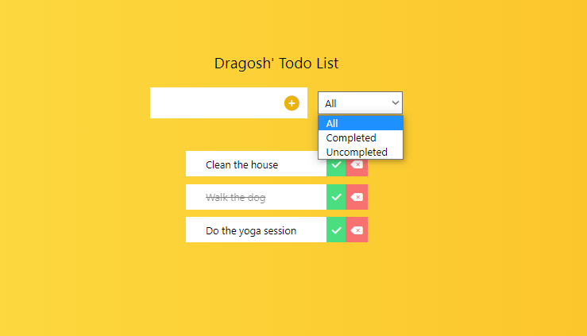

# React.js + TailwindCSS Todo App

Todo Application build with CRA template as well with TailwindCSS for styling . I have used `Local Storage` as well for saving the todos in it after quitting or reloading the app.

## Preview

## Live Demo

[Live Demo](https://todo-app-practice-reactjs.netlify.app)

## My social activity

